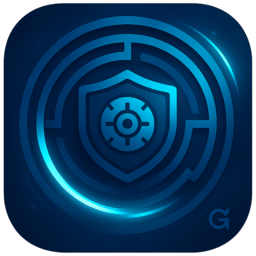
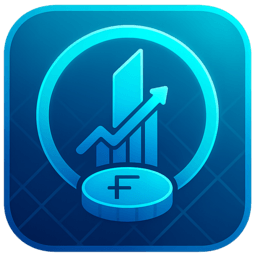
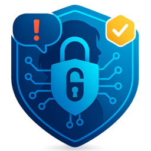
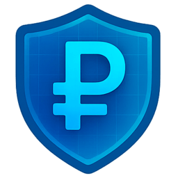
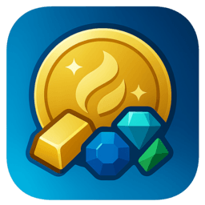
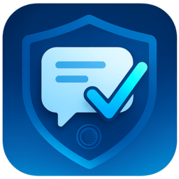
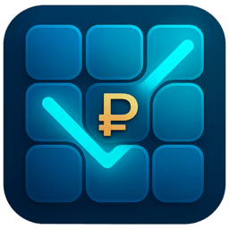
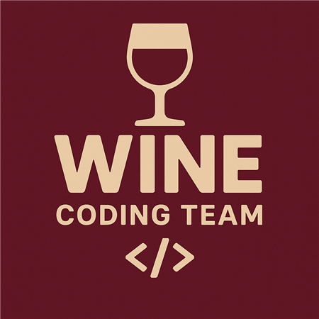

<div align="center">


&nbsp;&nbsp;&nbsp;&nbsp;


### Задача 5
## Геймификация в мобильном приложении банка для повышения финансовой грамотности


# 🎮 Игровой Центр Газпромбанка


### Экосистема финансовой грамотности через геймификацию

**Команда Wine Coding Team**

[](https://t.me/GPBGameCenterBot/play)
[](https://gpb-game-center.vercel.app/)

[🚀 Запустить в Telegram](#-быстрый-старт) • [📱 Web версия](#web-версия) • [🎯 О проекте](#-о-проекте) • [🛠 Технологии](#-технологический-стек)

</div>

---

## 🚀 Быстрый Старт

### Telegram Mini App (Рекомендуется)

Полная интеграция с мобильным устройством: вибрация, гироскоп, уведомления

<div align="center">

**Отсканируйте QR-код для запуска в Telegram:**


**или перейдите по ссылке:** [t.me/GPBGameCenterBot/play](https://t.me/GPBGameCenterBot/play)

</div>

### Web Версия

Работает в любом браузере: [gpb-game-center.vercel.app](https://gpb-game-center.vercel.app/)

---

## 📦 Установка и Запуск

```bash
# Установка зависимостей
npm install

# Запуск в режиме разработки
npm run dev

# Сборка для продакшена
npm run build

# Превью продакшен-сборки
npm run preview
```

Приложение запускается на `http://localhost:5173`

---

## 🎯 О Проекте

**Игровой Центр Газпромбанка** — это не просто одна игра, а целая **экосистема из 7+ интерактивных игр**, разработанная для повышения финансовой грамотности клиентов банка через увлекательную геймификацию.

### Стратегическое Видение

🎓 **Образование через игру** — сложные финансовые продукты простым языком
🛡️ **Защита от мошенников** — обучение распознаванию схем обмана
💰 **Способы сбережения** — практические навыки управления финансами
📈 **Увеличение retention** — повторные визиты через игровые механики

### Ключевые Особенности

✨ **Уникальная интеграция с устройством** через Telegram WebApp SDK
🎮 **7 активных игр** различных жанров для разной аудитории
🏆 **Система наград** с реальными банковскими продуктами
📊 **Органичная продуктовая интеграция** в игровой процесс
🎨 **Премиальный дизайн** в фирменном стиле Газпромбанка

---

## 🛠 Технологический Стек

### Core Framework
- **Svelte 5** — реактивный фреймворк с новым синтаксисом runes
- **SvelteKit** — full-stack фреймворк для WebView интеграции
- **TypeScript** — строгая типизация для надежности кода
- **Vite** — быстрый bundler с code-splitting

### Игровые Движки
- **Matter.js** — физический движок для 2D симуляций
- **Pixi.js** — высокопроизводительный 2D рендеринг

### Стили и UI/UX
- **Tailwind CSS 4.0** — утилитарный CSS фреймворк
- **Custom Design System** — фирменный стиль Газпромбанка
- **60 FPS рендеринг** — плавная анимация

### Интеграция
- **Telegram WebApp SDK** — вибрация, гироскоп, уведомления
- **WebView Ready** — готовность к встраиванию в мобильное приложение

---

## 🎮 Игровая Экосистема

<div align="center">

### Флагманские Игры

<table>
<tr>
<td align="center" width="33%">
<br>
<b>Asset Guardian</b><br>
<i>Гироскоп-лабиринт</i><br>
Управление активами через физический пазл
</td>
<td align="center" width="33%">
<br>
<b>FinCity</b><br>
<i>Городостроитель</i><br>
Экономический симулятор с 6 типами зданий
</td>
<td align="center" width="33%">
<br>
<b>Code to Success</b><br>
<i>Визуальная новелла</i><br>
Интерактивная история о кибербезопасности
</td>
</tr>
</table>

### Образовательные Игры

<table>
<tr>
<td align="center" width="25%">
<br>
<b>Quiz Shield Ruble</b><br>
<i>Квиз по антифроду</i>
</td>
<td align="center" width="25%">
<br>
<b>Match3 Golden Reserve</b><br>
<i>Match-3 головоломка</i>
</td>
<td align="center" width="25%">
<br>
<b>Anti-Fraud Hunter</b><br>
<i>Реакционная аркада</i>
</td>
<td align="center" width="25%">
<br>
<b>Crossword Financial</b><br>
<i>Финансовый кроссворд</i>
</td>
</tr>
</table>

</div>

---

## 📁 Структура Проекта

```
gpb-game-center/
├── src/
│   ├── lib/
│   │   ├── components/          # UI компоненты
│   │   ├── stores/             # Управление состоянием (Svelte 5 runes)
│   │   ├── telegram/           # Telegram WebApp интеграция
│   │   ├── data/               # Игры, награды, задания
│   │   └── utils/              # Вспомогательные функции
│   ├── routes/
│   │   ├── +page.svelte        # Главная страница
│   │   ├── +layout.svelte      # Корневой лейаут
│   │   └── api/notify/         # API для уведомлений
│   └── games/                  # Игровые модули
│       ├── quiz-shield-ruble/      # 🛡️ Квиз по безопасности
│       ├── match3-golden-reserve/  # 💎 Match-3 головоломка
│       ├── fincity/                # 🏙️ Городостроитель
│       ├── anti-fraud-hunter/      # 🎯 Аркада антифрод
│       ├── code-to-success/        # 📖 Визуальная новелла
│       ├── asset-guardian/         # 🌀 Гироскоп-лабиринт
│       └── crossword-financial/    # 🔤 Кроссворд
├── static/
│   ├── logos/              # Логотипы игр
│   ├── qr.png             # QR для Telegram
│   ├── logo_game.png      # Логотип центра
│   └── logo_black.svg     # Газпром.Тех
└── package.json
```

---

## 🚀 Инновации и Преимущества

### Технические Инновации

- 🎯 **Гироскопное управление** — первая банковская игра с управлением гироскопом
- ⚡ **Модульная архитектура** — динамическая загрузка игр через code-splitting
- 📱 **WebView интеграция** — готовность к встраиванию в мобильное приложение
- 🔔 **Умные уведомления** — персонализированные пуш через Telegram Bot

### UX/UI Особенности

- 📐 **Вертикальная ориентация** — нативный банковский опыт
- 🎨 **Фирменный стиль** — строгое следование брендбуку Газпромбанка
- 📳 **Haptic feedback** — тактильный отклик при взаимодействии
- ♿ **Accessibility** — поддержка screen readers и клавиатурной навигации

### Бизнес-Ценность

- 📈 **Увеличение retention** — множественные механики возврата
- 💰 **Повышение конверсии** — органичная интеграция банковских продуктов
- 🎓 **Образовательная ценность** — практическое обучение через игру
- 🎁 **Система наград** — реальные бонусы от банка и партнеров

---

## 🎓 Образовательный Контент

### Темы Обучения

- 🛡️ **Антифрод** — распознавание мошеннических схем
- 💳 **Банковские продукты** — депозиты, карты, инвестиции
- 💰 **Сбережения** — накопительные счета, долгосрочные программы
- 📊 **Инвестиции** — портфели, брокерское обслуживание
- 🏢 **Бизнес-банкинг** — зарплатные проекты, расчетные счета

### Система Наград

**Глобальные очки** из всех игр → **Реальные бонусы:**

- 🌟 Газпромбанк Премиум (10,000 очков)
- 🍽️ Повышенный кешбек рестораны (5,000 очков)
- 📦 Ozon Premium (2,000 очков)
- 🛒 Лента скидка 13% (1,000 очков)
- ⛽ АЗС Газпромнефть бонусы (1,000 очков)
- 🍕 Додо Пицца (1,000 очков)

---

## 📊 Архитектура Управления Состоянием

```typescript
// Svelte 5 Runes для реактивности
navigationStore    // Управление экранами и модалками
gameStore         // Игровые сессии и прогресс
pointsStore       // Глобальная валюта и транзакции
tasksStore        // Ежедневные задания и стрик
telegramStore     // Интеграция с Telegram WebApp
```

---

## 🎯 Соответствие Требованиям Хакатона

### ✅ Полное Соответствие ТЗ

- ✅ **WebView интеграция** — готовность к встраиванию в мобильное приложение
- ✅ **Вертикальная ориентация** — нативный банковский опыт
- ✅ **Без сбора данных** — работа без регистрации/авторизации
- ✅ **Финансовая грамотность** — образовательный контент в каждой игре
- ✅ **Органичная интеграция продуктов** — банковские услуги в геймплее
- ✅ **Визуальное совершенство** — премиальный дизайн и анимации
- ✅ **Система уведомлений** — умные пуши для retention

### 🏆 Дополнительные Преимущества

- 🎮 **7 игр вместо одной** — максимальная вовлеченность разной аудитории
- 📱 **Telegram интеграция** — демонстрация WebView возможностей
- 🌀 **Гироскоп управление** — уникальная техническая инновация
- 📊 **Масштабируемость** — легкое добавление новых игр и продуктов

---

## 👥 Команда

<div align="center">



### Wine Coding Team

<table>
<tr>
<td align="center" width="33%">
<b>Павел Волков</b><br>
<i>Капитан • Fullstack</i>
</td>
<td align="center" width="33%">
<b>Роман Науменко</b><br>
<i>Fullstack • Design</i>
</td>
<td align="center" width="33%">
<b>Николай Иртуганов</b><br>
<i>Fullstack • Game Design</i>
</td>
</tr>
</table>

</div>

---

## 📄 Лицензия

Проект разработан в рамках хакатона ЛЦТ 2025

---

<div align="center">

### 🎮 Начните играть прямо сейчас!

[](https://t.me/GPBGameCenterBot/play)
[](https://gpb-game-center.vercel.app/)

**Игровой Центр Газпромбанка** — финансовая грамотность через увлекательную игру

</div>
